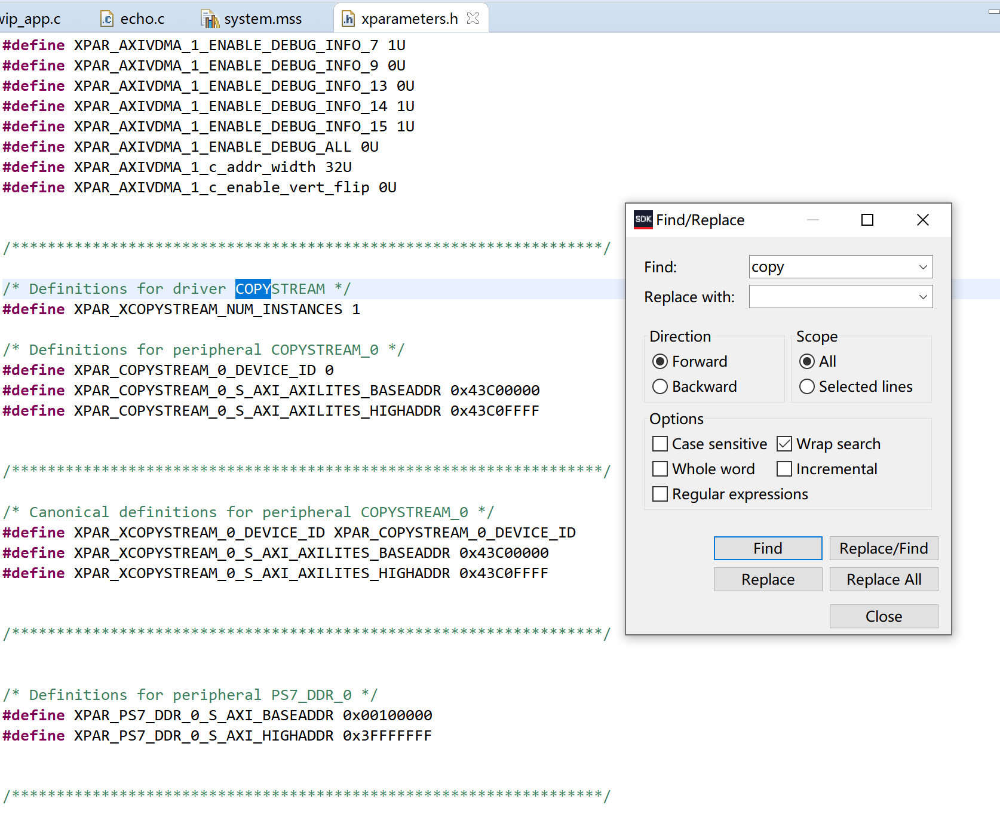

# Vivado SDK无法更新硬件信息解决方法

GitHub地址：https://github.com/liuqiang-bit/Problems-And-Solutions.git

作者：GUDONG		时间：2020/08/15		软件：Vivado 2018.3、Vivado SDK 2018.3

------

> ***目录***

[TOC]

------

## 一.问题描述

​		用高版本vivado在低版本vivado创建的的工程中加入新模块并按照流程: Generate Output Products -> Create HDL Wrapper -> Run Synthesis -> Generate Bitstream -> Export Hardware -> Launch SDK启动Vivado SKD软件。

​		Vivado SDK 软件启动后发现xparameters.h中没有此模块的地址信息，且项目bsp文件目录下的libsrc文件夹中也没有此模块的驱动文件夹。

## 二.其他人的解决措施

​		备份现有的Application的源代码文件，再删除现有的Application及其bsp文件夹。并新建Application（不删Application，只新建bsp文件一般就能解决），将备份的源代码复制到新工程中。

​		此种方法对于没有使用旧版第三方库的工程较为方便，但若使用的旧版第3方库的工程来说将会导致新建的Application的第三方库兼容性问题：

​	例如，Vivado SDK 2018.3默认调用LWIP202库，Vivado SDK 2017.4 默认调用LWIP141库。若工程是在2017.4版本Vivado SDK中建立的，现要在2018.3中修改并遇到了所述问题。则删除现有Application的bsp后，新建的bsp调用的LWIP202库，将导致LWIP相关文件报错。虽然修改bsp文件夹中system.mss文件可以重新调用LWIP141，但极有可能遇上bsp没有替换LWIP库文件，继续报错的情况，详细情况后面实操演示。

## 三.演示其他人的解决措施的弊端

​		此条目演示第二点所述新建Application后，第三方库文件报错问题。

> ​		原工程由Vivado 2017.4创建，现使用Vivado 2018.3修改。
>

### 1.打开工程，更新IP

​		打开工程后，提示更新IP, 点击最下方的"Upgrade Selected"按钮：

​		更新完成弹出如下窗口，选择"skip", 等添加新IP后一起Generate。

​		此时Diagram界面如下。

### 2.添加新IP "copyStream_0"

​		连线后Diagram部分界面如下

### 3. 启动按流程启动SDK。

​		Generate Output Products -> Create HDL Wrapper -> Run Synthesis -> Generate Bitstream -> Export Hardware -> Launch SDK启动Vivado SKD软件。

​		此时，"system_wrapper_hw_platform_0"中已经有"copyStream_v1_0"的驱动文件夹，但bsp中的libsrc目录下没有。

​		在"xparameters.h"中也没有此模块的寄存器信息。

### 4.查看bsp配置

​		右键"lwip_double_video_bsp" 选择 Board Support Package Settings选项。

​		可以看见此工程使用的LWIP141库。

### 5.指定工程使用旧版库

​		删除 "lwip_double_video_bsp", 新建bsp， 同样命名为"lwip_double_video_bsp", 发现LWIP库只能选择LWIP202. 没有LWIP141选项， 勾选LWIP202后点"OK"。

​		生成的新bsp中有"copyStream_v1_0"驱动文件夹。

​		"xparameters.h"中也有此模块寄存器信息。

​		但是LWIP相关文件报错，基于LWIP141编写的程序与LWIP202有不兼容的地方, 若不熟悉新库，修改将较为麻烦。

### 6.将库替换为LWIP141库。

​		双击system.mss

​		在打开的界面选择"Source"选项卡, 并找到LWIP配置部分。

​		打开原项目的system.mss找到LWIP配置。

​		用LWIP141的配置低代码替换LWIP202的配置代码，并保存，开始自动编译， 但编译结束后依旧是第7点所说的错误，原因是bsp中的库文件没有自动替换成LWIP141库。

​		手动替换库文件较麻烦，且不仅仅这一个地方需要替换，若有多个第三方库要替换的话，较为麻烦。 因此不推荐此方法。

## 四.我的方法

### 1.按上述步骤进行到第五步。

### 2.复制驱动文件夹到bsp

​		打开工程目录，将\system_wrapper_hw_platform_0\drivers\copyStream_v1_0文件夹拷贝到\lwip_double_video_bsp\ps7_cortexa9_0\libsrc文件夹下。

### 3.刷新bsp

​		右键"lwip_double_video_bsp"， 选择Refresh。

​		刷新后lwip_double_video_bsp\libsrc中将包含copyStream_v1_0文件夹。

​		但编译后驱动文件会报错。

​	打开报错文件，错误在于"xparameters.h"中没有添加此模块的地址等的宏定义。

### 4.新建Application并拷贝"xparameters.h"中的模块信息。

​		命名与模板随意，仅仅用于生成新的"xparameters.h"

​		下图中的temp工程为新建的Application。

​		展开目录\temp_bsp\ps7_cortexa9_0\include，打开"xparameters.h"。

​		在其中找到copyStream_0模块的地址等信息。

​		复制这些内容并粘贴到原Application的"xparameters.h"中，即复制到lwip_double_video_bsp中的"xparameters.h"中，保存编译。

> ​		此时可能遇见驱动文件没有错误图标，但编译器报错说xxx未定义，出现此种情况就用新建的Application中的驱动文件加替换原bsp中的驱动文件夹。即用temp_bsp\libsrc中的copyStream_v1_0文件夹替换lwip_double_video_bsp\libsrc的copyStream_v1_0文件夹。刷新并编译即可。

### 5.下载验证。

​		功能正常

### 6.删除新建的Application。